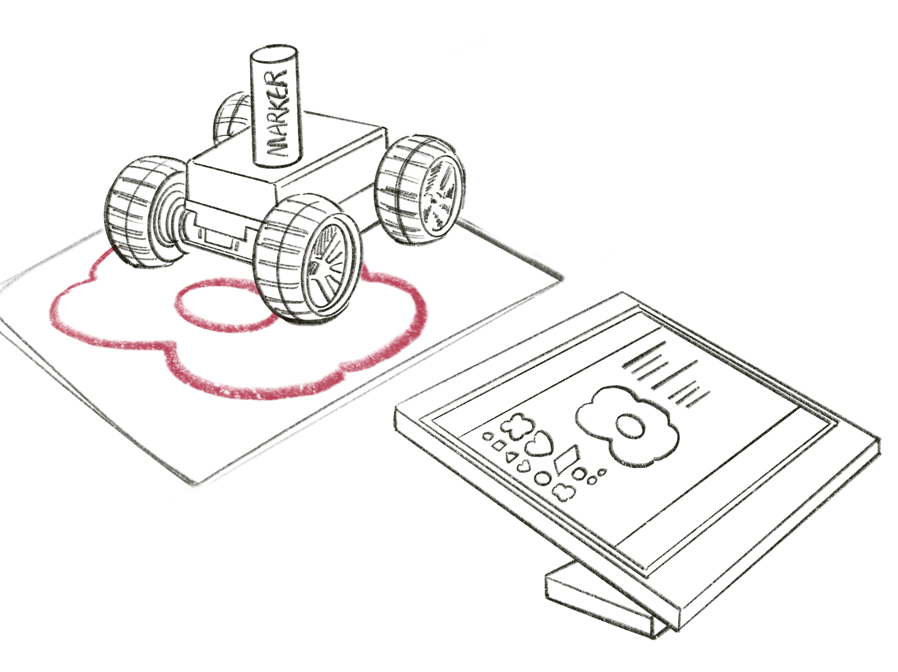
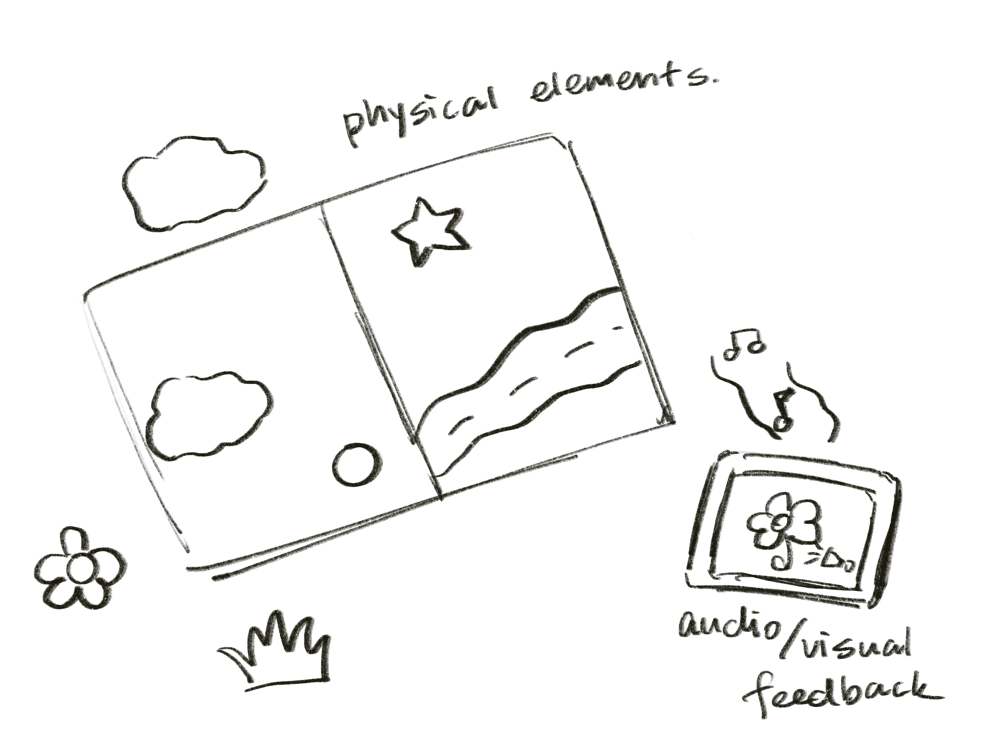
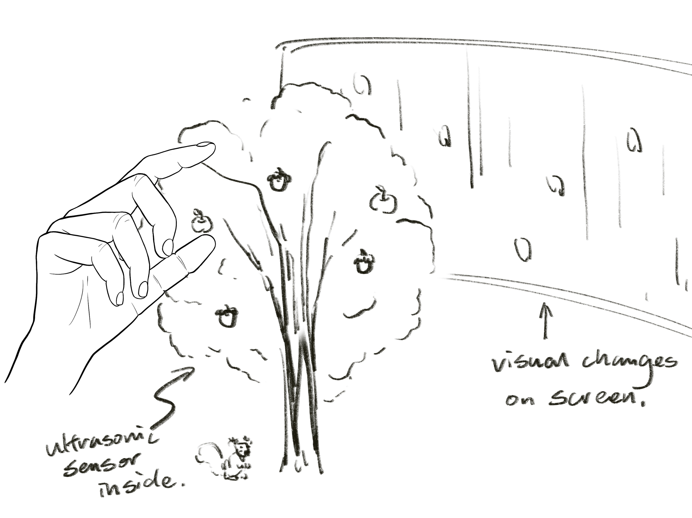

## Milestone 1

### IDEA 1: Canvas in Motion  

Create a dynamic art installation where a robot car, controlled by Arduino, moves across a canvas, leaving a trail of colors. The car's movement and color patterns will be influenced by audience interaction, captured through a p5.js sketch. This installation aims to explore the intersection of technology and art, creating a space where audience participation directly shapes the artwork.  

Inputs:  

1. Audience Interaction: Inputs are gathered from the audience through a p5.js sketch. This could include touchscreen inputs, mouse movements, keyboard entries, or even more complex inputs like gesture or voice commands.  

Outputs:  

1. Robot Car Movement: The car moves across the canvas based on the audience's inputs.  

2. Color Patterns: The car leaves a trail of colors on the canvas, with patterns influenced by the audience interaction data received through the p5.js sketch.  

### IDEA 2: Interactive Storybook for Kids  
Create a children's storybook where the plot progression and narrative elements are influenced by the child's interaction with physical objects. These interactions will trigger audio and visual feedback generated by p5.js, enhancing the storytelling experience and making it more engaging and educational.  

  

Inputs:  

1. Child’s Interaction with Physical Objects: Children interact with the storybook through physical objects that might include touch, buttons, or movable elements.  

Outputs:  

1. Story Progression: The narrative of the story changes based on the child’s interactions, leading to different plot developments.  

2. Audio Feedback: Sounds, music, or narrations are triggered in response to interactions, enhancing the storytelling experience.  

3. Visual Feedback: Visual changes on a connected digital interface (like animations or color changes) occur in response to interactions.  

### IDEA 3: Sustainable Art Installation  

Create an interactive art installation that seeks to engage viewers in a conversation about sustainability and our connection with the natural world. Utilizing ultrasonic sensors and micro servo motors, this installation will create a dynamic experience where art elements move or change as viewers approach, symbolizing the delicate interplay between humans and nature.  

Inputs:  

1. Viewer Proximity and Movement: Detected by ultrasonic sensors. The sensors gauge how close viewers are to different parts of the installation.  

Outputs:  

1. Movement of Art Elements: Art elements within the installation move or change in response to viewer proximity, controlled by micro servo motors.  

2. Lighting and Sound Changes: Responsive changes in lighting and ambient soundscapes that adjust according to viewer interaction.  

3. Visual Transformation on Screen: The installation might also include visual changes like color shifts or pattern alterations, reacting to the inputs received.  
